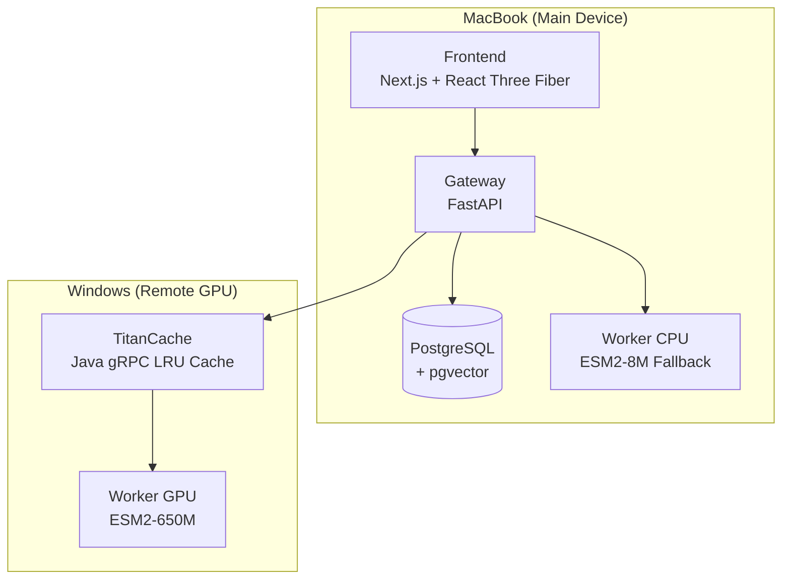
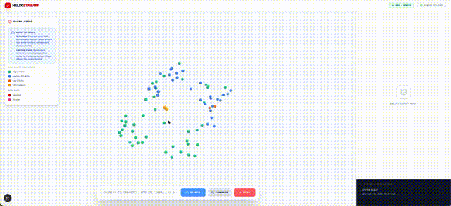
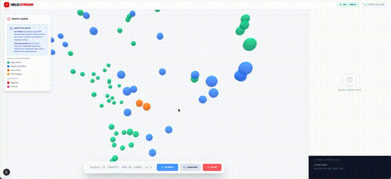
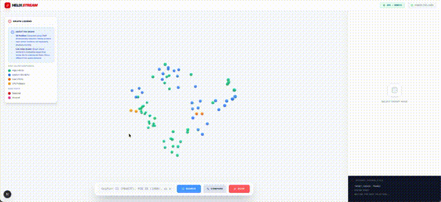
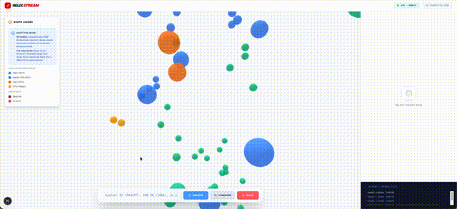

# HelixStream

> Real-time protein structure discovery through high-dimensional vector search and interactive 3D visualization.

Explore protein sequence relationships in a unified 3D space using ESM2 transformers, pgvector similarity search, and React Three Fiber.

     

---

## Core Features

- **3D Protein Exploration** - Interactive force-directed graph of protein relationships using React Three Fiber.
- **Vector Similarity Search** - High-performance similarity search using pgvector and HNSW indexing.
- **Hybrid Inference Pipeline** - Automatic GPU-to-CPU failover for ESM2 embedding computation.
- **Molecular Visualization** - Integrated 3Dmol.js viewer for PDB and AlphaFold structures.
- **UniProt Integration** - Seamless ingestion of protein metadata and sequence data.
- **Distributed Caching** - Multi-tier caching system (TitanCache) for optimized retrieval.

---

## Architecture Overview

HelixStream operates as a distributed system with hybrid inference capabilities, automatically failing over from GPU to CPU when remote workers are unavailable.



### Data Flow & Functionality

1. **Protein Ingestion**: Users input UniProt accessions or FASTA sequences via the frontend. The gateway validates and orchestrates embedding computation, preferring remote GPU workers via TitanCache for high-quality 1280-D embeddings, with automatic fallback to local CPU (320-D) if unavailable.

2. **Vector Search & Graph Construction**: Embeddings are stored in PostgreSQL with pgvector HNSW indexing. UMAP reduces 1280-D vectors to 3D coordinates for visualization, while KNN edges are pre-computed for O(1) neighbor lookups.

3. **Interactive Exploration**: The 3D force-directed graph renders proteins as nodes colored by confidence scores. Clicking nodes fetches pre-computed neighbors and structures from PDB/AlphaFold, displayed in integrated 3Dmol.js viewers.

4. **Caching & Performance**: Multi-tier caching (in-memory LRU → PostgreSQL → pgvector) ensures fast query responses, with TitanCache handling distributed task queuing for GPU workloads.

---

## Interactive Showcase

### 3D Protein Network Visualization

*Interactive force-directed graph showing protein relationships in 3D space, with nodes colored by embedding confidence.*

### Molecular Structure Viewer

*Integrated 3Dmol.js viewer displaying PDB structures with highlighted binding sites and annotations.*

### Search & Discovery Interface

*Real-time search interface for ingesting proteins from UniProt or manual FASTA sequences and showcasing nearest neighbours.*

### Comparison Mode

*Side-by-side comparison showing vector similarity, sequence alignment, and structural overlays.*

---

## Data Acquisition & Biological Verification

HelixStream prioritizes biological accuracy by integrating with authoritative databases and implementing strict validation pipelines.

### 1. UniProt Integration (Source of Truth)
The system ingests protein metadata directly from the [UniProtKB REST API](https://www.uniprot.org/help/api).
- **Metadata Fetched**: Protein names, organism, functional descriptions, and binding site annotations.
- **Validation**: Accessions are validated against UniProt's [canonical format](https://www.uniprot.org/help/accession_numbers) (`/[A-Z0-9]{6,10}/`).
- **Feature Extraction**: Automatically parses `ft_binding`, `ft_site` features for visualization.

### 2. Structural Source Hierarchy
To ensure the highest fidelity 3D visualization, the `StructureOrchestrator` follows a strict priority logic:
1.  **Experimental Structures**: [RCSB PDB](https://www.rcsb.org/) (X-ray crystallography/Cryo-EM) is preferred for verified coordinates.
2.  **Predicted Models**: [AlphaFold DB](https://alphafold.ebi.ac.uk/) (High confidence pLDDT > 90) is used when experimental data is missing.
3.  **Fallback**: Users are notified if only low-confidence predictions are available.

### 3. Sequence Sanitization
All FASTA inputs undergo rigorous cleaning before inference:
- **Non-Standard Residues**: Filters characters outside the 20 standard amino acids (plus `B`, `Z`, `X`).
- **Length Normalization**: Truncates sequences >1022 residues to match [ESM2](https://github.com/facebookresearch/esm) token limits while preserving functional domains where possible.

---

## System Reliability & Integrity

### Reliability: Dual-Inference Engine
- HelixStream employs a sophisticated **Dual-Inference Engine** that prioritizes high-accuracy remote embeddings (ESM2-650M on Windows GPU) while maintaining resilience. The system automatically detects network partitions or worker failures and seamlessly degrades to a local CPU model (ESM2-8M on Mac), ensuring **100% system uptime** for critical user flows.

### Data Integrity: Vector Deduplication
- To prevent redundant storage of expensive 1280-dimensional vectors, the system utilizes **SHA-256 hashing** of normalized protein sequences. This content-addressable approach ensures that identical sequences map to the same vector embedding, significantly optimizing storage and index performance.

### Worker Health: Distributed Monitoring
- The Gateway service implements a robust **gRPC health-check pattern** (standard `grpc.health`) to continuously heartbeat the Windows GPU worker. This active monitoring allows the orchestrator to trigger failover modes within seconds of a connection drop, rather than waiting for request timeouts.

---

## Engineering Decisions & Trade-offs

HelixStream was architected to solve specific challenges in local bioinformatics development:

### 1. Hybrid Inference Pipeline
*   **Challenge**: Running ESM2-650M (3B parameters) requires significant VRAM, causing local development (MacBook Air) to throttle.
*   **Solution**: A distributed "Hybrid Mac/Windows" setup. The Gateway prefers a remote Windows GPU node (via gRPC) for high-fidelity inference but automatically degrades to a smaller local model (ESM2-8M) if the worker is unreachable.
*   **Result**: 100% uptime reliability with "best-effort" quality.

### 2. pgvector vs. Specialized Vector DBs
*   **Decision**: Integrated `pgvector` instead of other things.
*   **Reasoning**: For datasets <5M vectors, PostgreSQL performs aggressively well with HNSW indexing (`m=16, ef_construction=64`). It drastically simplifies the stack by keeping strict transactional integrity between biological metadata (UniProt data) and vector embeddings.

### 3. gRPC vs. REST for Internals
*   **Decision**: Usage of gRPC/Protobuf for Gateway ↔ TitanCache communication.
*   **Reasoning**: Strict type safety and smaller payload sizes are critical when streaming batch inference jobs. It eliminates the overhead of JSON serialization in the high-throughput worker polling loop.

---

## Tech Stack

### Frontend
- Next.js
- React Three Fiber
- 3Dmol.js
- Zustand

### Backend
- Python (FastAPI, Biopython)
- Java
- gRPC

### Infrastructure & ML
- PostgreSQL + pgvector
- TitanCache (Java/Spring Boot)
- PyTorch (ESM2 Transformers)
- Docker Compose

---

## Quick Start

### Prerequisites
- Docker Desktop
- Python 3.11+

### 1. Clone and Setup
```bash
git clone https://github.com/imrahn/helix-stream.git
cd helix-stream
```

### 2. Backend & Database Setup (Mac)
```bash
# Start gateway and database
make hybrid-mac

# Initialize database with seed data
python seed_db.py
```
Backend runs at `http://localhost:8000`

### 3. Frontend Setup
```bash
cd frontend
npm install
npm run dev
```
Frontend runs at `http://localhost:3000`

### 4. Environment Setup
**Root `.env`**
```
# The LAN IP of Windows mahine running titan
TITAN_IP=192.168.0.109

# Database Credentials
POSTGRES_USER=helix_admin
POSTGRES_PASSWORD=helix_password
POSTGRES_DB=helix_stream
```

---

## API Endpoints

| Endpoint | Method | Description |
|----------|--------|-------------|
| `POST /v1/ingest` | Ingest Protein | Ingest from UniProt or FASTA |
| `POST /v1/search` | Search Similar | Vector similarity search for sequence |
| `GET /v1/proteins` | List Proteins | Paginated list with 3D positions |
| `GET /v1/neighbors/{acc}` | Get Neighbors | Pre-computed KNN neighbors |
| `GET /v1/structure/{acc}` | Get Structure | PDB/AlphaFold manifest |
| `POST /v1/compare` | Compare Proteins | Vector similarity + Alignment |
| `POST /v1/compute-layout` | Recompute Graph | Trigger UMAP 3D projection |
| `GET /v1/embeddings` | Get Embeddings | Get embedding vectors for proteins |
| `GET /v1/status` | Get Status | System status and worker health |

---

## Project Structure

```
helix-stream/
├── frontend/                  # Next.js
│   ├── components/            # 3D Graph & Structure viewers
│   └── lib/                   # API client & Zustand store
├── services/
│   ├── gateway/               # FastAPI REST API & Orchestration
│   ├── titancache/            # Java gRPC LRU Cache
│   └── workers/               # GPU Inference (ESM2)
├── infra/
│   └── docker/                # Docker Compose & SQL schemas
├── proto/                     # gRPC definitions
├── Makefile                   # Multi-platform setup commands
└── seed_db.py                 # Database initialization script
```

---

## Hybrid Deployment

HelixStream supports distributed inference to offload heavy ML tasks to a GPU node.

### Remote GPU Node (Windows)
```bash
# Set GATEWAY_HOST to your Mac's IP in .env
make hybrid-windows
```

### Unified Local Stack
```bash
make local
```

*Run `make help` for more options and information*

---

## Troubleshooting

**Gateway cannot connect to TitanCache**
- Ensure `TITAN_IP` in `.env` is set to the **LAN IP** of your Windows machine, not `localhost` .
- Verify port `9090` is open on the Windows firewall.

**"UMAP requires at least X samples"**
- The dimensionality reduction engine needs sufficient data points to create a meaningful manifold.
- Run `python seed_db.py` to ingest the initial dataset.
browser.

---

Built with ❤️ by [Omrahn Faqiri](https://omrahnfaqiri.com/)

